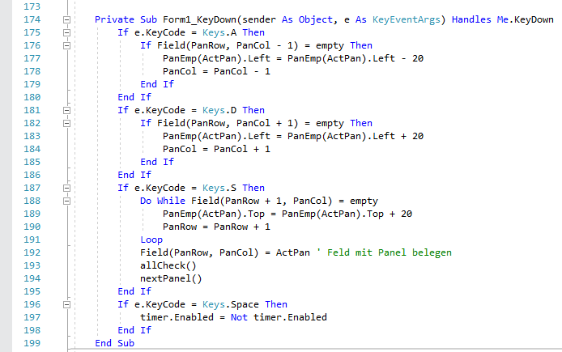

<h1>Colorstack</h1>

In diesem Projekt wird mithilfe von Visual Basic ein Spiel erstellt, dass dem bekannten Tetris ähnelt.

  
<h2>Inhaltserzeichnis</h2>
<ul>
<li><a href="#Col">1. Colorstack</a></li>
<li><a href="#Vis">2. Visual Basic</a></li>
<li><a href="#Var">3. Variablen</a></li>
<li><a href="#Spi">4. Das Spielfeld</a></li>
<li><a href="#Ste">5. Steuerung</a></li>
<li><a href="#Ers">6. Erstellen von Blöcken</a></li>
<li><a href="#Fal">7. Fallen von Blöcken</a></li>
<li><a href="#Lös">8. Löschen von Blöcken</a></li>
<li><a href="#Hig">9. Highscore</a></li>
<li><a href="#Stu">10. Stundenprotokoll</a></li>
</ul>
  
<h2><a id="Col">1. Colorstack</a></h2>

In dem Spiel Colorstack ist es das Ziel, drei gleichfarbige Blöcke neben- oder übereinander zu platzieren. Die Steuerung erfolgt durch "A" und "D" um den aktiven Block nach links und rechts zu verschieben, mit "S" kann der Block sofort in die unterste mögliche Reihe verschoben werden. Mit "Leertaste" wird das Spiel pausiert. 
Sobald drei gleichfarbige Blöcke neben- oder übereinander liegen werden diese entfernt und der Spieler erhält einen Punkt. Die Blockgeschwindigkeit steigt jedesmal, wenn Blöcke entfernt werden. 
Sobald kein Block mehr erstellt werden kann, weil das Spielfeld nach oben hin gefüllt ist, ist das Spiel vorbei.

<h2><a id="Vis">2. Visual Basic</a></h2>

Visual Basic ist eine von Microsoft angebotene Programmiersprache, die in Visual Studio verwendet werden kann. Diese ähnelt C# in vielen Aspekten, statt nur reinem Code kann aber auch eine visuelle Darstellung des späteren Programms erstellt werden. Durch die von Visual Studio bereitgestellte Toolbox können Funktionen hinzugefügt werden, wie Buttons, Panels und Timer. Diese Funktionen werden direkt in den Code übernommen und es kann mit diesen normal weitergearbeitet werden, wie in C#.

  
<h2><a id="Var">3. Variablen</a></h2>
Die global verwendeten Variablen werden am Anfang deklariert.  
Die globalen Variablen sind:

<h2><a id="Spi">4. Spielfeld</a></h2>

Das Spielfeld ist in einzelne Felder unterteilt und die Blöcke, die als Panels definiert sind, besetzen die Felder. Dies geschieht dadurch, dass der Wert des Feldes verändert wird. Die Randfelder erhalten den Wert -2. Selbst wenn ein Block versucht dieses Feld zu besetzen wird der Wert des Feldes von -2 auf -1 verändert und das Feld gilt weiterhin als leer. 
Ein normales Feld, welches besetzt werden darf, besitzt im leeren Zustand einen Wert von -1, wenn dieses nun besetzt wird verändert sich der Wert auf 0. Ein Feld mit dem Wert 0 wird nicht weiter besetzt und wird im späteren Verlauf darauf überprüft, ob drei gleiche Blöcke nebeneinander liegen. 
Im Code wird das Spielfeld als Arraylist behandelt, wodurch das Eintragen dieser Werte ermöglicht wird.

<h2><a id="Ste">5. Steuerung</a></h2>

Die Steuerung geschieht durch vier Tastaturbefehle. 
Die Blöcke können nach links und rechts mit "A" und "D" verschoben werden. Um den aktiven Block fallen zu lassen wird "S" verwendet. Wenn das Spiel pausiert werden soll wird die "Leertase" verwendet, durch diesen Befehl wird der Timer angehalten und der aktive Block bewegt sich nicht weiter.  
Für die Steuerung wird die "KeyDown" Funktion verwendet. Mit diesem Befehl wird beim Eindrücken der Taste ein Befehl ausgelöst. In der Funktion wird durch eine If-Abfrage überprüft, ob bestimmte Befehle von der Tastatur gegeben werden

  
<h2><a id="Ers">6. Erstellen von Blöcken</a></h2>

Die Blöcke werden als Panels behandelt, jedes Panel besitzt eine Größe von 20x20 Pixeln. Beim verschieben der Blöcke wird immer eine Positionsveränderung von 20 Pixeln verwendet, somit existieren acht feste Spalten, in denen sich Blöcke befinden können. Beim erstellen ist die Größe fest definiert, die Farbe wird zufällig ausgewählt. Aus einer Liste von acht möglichen Farben wird eine ausgewählt für den neuen Block. Das Spiel ist also zu keinem Zeitpunkt unfair, es gibt nicht mehr mögliche Farben als Spalten. Das Panel wird nun der Arraylist hinzugefügt und somit vermerkt, um es später wieder löschen zu können.

Das Vermerken der Farbe ist wichtig, da durch diese später entschieden wird, ob das Panel aus dem Programm entladen wird.

  
<h2><a id="Fal">7. Fallen von Blöcken</a></h2>

Der aktive Block fällt um den definierten Betrag von 20 Pixeln wenn der Timer einen Tick durchlaufen hat. Zu Beginn dauert dies 0,5 Sekunden. Immer wenn Blöcke entfernt werden und das level um eins erhöht wird steigt der Schwierigkeitsgrad, dies wird durch eine Verringerung der Tick-Länge verursacht. Dafür wird eine Variable verwendet, die beim Löschen der Blöcke um eins erhöt wird. Mit dieser variable wird der Zeitintervall berrechnet. 
In der Timer Funktion wird auch das Game Over Event behandelt, sobald ein Block die oberste Zeile berührt und nicht weiter fallen kann wirdt der Timer angehalten und eine "Game Over" Message Box erscheint.

Die vorherige Stufe wird um eins erhöht und das Intervall von 0,5 Sekunden durch die neue Stufe + 9 geteilt. Dadurch werden die Zeitintevalle pro Tick kontinuirlich kürzer und es wird schwieriger, die Blöcke richtig zu platzieren. Theoretisch können die Intervalle extrem kurz werden, ab einem bestimmten Punkt wird es aber schwierig, die Kontrolle zu behalten und das Spiel endet.

<h2><a id="Lös">8. Löschen von Blöcken</a></h2>

Um die Blöcke zu löschen muss zuerst festgestellt werden, ob drei gleichfarbige Blöcke neben- oder übereinander angeordnet sind. Dies wird in zwei Funktionen aufgeteilt, eine zum prüfen der nebeneinander liegenden Blöcke und eine für die Blöcke übereinander. 
Eine weitere Funktion ist "Alle Prüfen", diese ruft "neben- und überprüfen" auf.

Die Funktion zum nebeinander prüfen.

Die Funktion zum übereinander prüfen.

Diese beiden Funktionen werden in einer weiteren Funktion aufgerufen, die sobald keine weiteren Panels zum löschen identifiziert werden die Freigabe gibt um einen neues Panel zu erzeugen. Sobald eine der Funktionen Panels entfernt wird der Wert des Counters um eins erhöht, da so ein Punkt erzielt wird. 
Für den Punktezähler wir ein Label verwenet, der wert daraus wird am Ende gespeichert und für den Highscore verwendet. 
Um den Schwierigkeitsgrad kontinuirlich zu erhöhen wird nach jedem entfernen von Panels durch die Funktionen der Zeitintervall des Timers verkürzt. Durch das Verkürzen der Intervall wird die Fallgeschwindigkeit der Blöcke erhöht und es wird schwieriger, die Blöcke richtig zu platzieren.

<h2><a id="Hig">9. Highscore</a></h2>

Der Highscore wird in einer txt-Datei gespeichert und kann jedes mal aufgerufen werden, wenn das Spiel gestartet wird. Es wird immer nur der höchste Highscore gespeichert, die txt-Datei kann im Programmordner gefunden werden. 
Es werden zwei Funktionen benutzt, um in der Datei schreiben zu können und um die Datei auslesen zu können.

Die Funktion zum schreiben befindet sich im timer, sobald die "game over" Message Box angezeigt wird prüft das Programm, ob der aktuelle Punktestand höher ist als der bisherige Rekord. Falls der aktuelle Punktestand höher ist als der Rekord wird der Spieler aufgefordert, seinen Namen einzugeben, dieser wird im Highscore gespeichert.

Wenn das Programm gestartet wird wird der aktuelle Highscore aus der txt-Datei geladen und im Spiel angezeigt. Dafür werden zwei Labels verwendet, Spielername und Highscore werden getrennt geladen. Die Funktion dafür befindet sich im Form1Loader, es wird also direkt zu Anfang ausgeführt.

<h2><a id="Stu">10.Stundenprotokoll</a></h2>
<h4>21.2.2017</h4>

Nach der html-Dokumentation folgt ein neues Projekt, in dieser Stunde habe Ich ein erstes Konzept für dieses erstellt. Mit Visual Basic sollte es möglich sein, ein Spiel nach dem Snake, Tetris oder Pong Prinzip zu schrieben ohne den großen Aufwand, eine komplette neue Programmiersprache zu lernen. 
Eine einfache Kopie eines der gernannten Spiele ist nicht das Ziel dieses Projekts, doch eine Anlehnung an diese Klassiker wäre ein realisierbares Ziel.

<h4>23.2.2017</h4>

Für das neue Projekt verwende ich das Raspberry Pi, darauf kann man mit der Programmiersprache Visual Basic arbeiten, welche leicht zu verstehen ist und schnell graphische Oberflächen erzeugen kann. Um Visual Basic auf dem Raspberry verwenden zu können muss Window 10 IOT verwendet werden. 
Windows 10 IOT ist eine von Windows angebotene Möglichkeit um Windows auf unter anderem dem Raspberry Pi Netzweksteuerung und Sensorensteuerung in Windows-Sprachen zu verwenden.

<h4>1.3.2017</h4>

Die Idee, dass Raspberry Pi zu verwenden ist prinzipiell umsetzbar, doch die Ausführung ist aufwendiger als erwartet und für die verbleibende Zeit zu knapp. 
Die Idee des Programms belibt erhalten, doch die Umsetzung findet normal auf dem PC in einer normalen Programmierumgebung statt. Am Ende wird das Spiel ein normales Programm sein, welches Installiert werden kann und als Prozess besteht. Eine Umsetzung auf dem Raspberry Pi könnte in Zukunft noch folgen. 
Erste Formen und Oberflächen des neuen Programms erstellt

<h4>2.3.2017</h4>

Erster Code für das Programm erstellt und das Spielfeld definiert. Eine Breite von acht Feldern ist überschaubar und wird das Maß des Spielfeldes sein. 
Äußerlich für den Spieler existiert eine Begrenzung durch drei Panels in Form von Lienien, im Code wird aber mit Pixel Zahlen für Blöcke und Spielfeld gearbeitet. Um das Spiel fair zu gestalten sollen acht verschiedenfarbige Blöcke integriert sein.

<h4>8.3.2017</h4>

In dieser Stunde weitergearbeitet am Code, die Blöcke können nun fallen durch einen Timer, bisher Stapeln die Blöcke sich aber noch unendlich, das Löschen von Blöcken ist noch nicht möglich. Auch ist der Schwierigkeitsgrad noch konstant, das Grundgerüst funktioniert aber wie angedacht.

<h4>9.3.2017</h4>

Aufgrund ovn technischen Problemen meines Laptops konnte Ich nicht am Code arbeiten, diese Stunde wurde verwendet um an der Dokumentation zu schreiben. Ein erstes Inhaltsverzeichnis wurde erstellt und Erklärungen zum bisherigen Code verfasst. 
Diese Erkärungen müssen aber zu einem späteren Zeitpunkt überarbeitet werden, wenn der restliche Code geschrieben ist.

<h4>14.3.2017</h4>

Das System für das Löschen der Blöcke erzeugt noch Fehler, wenn durch nachrücken von Blöcken ein weiteres mal Blöcke entfernt werden können ist dies bisher nicht geschehen. Den Großteil der Stunde habe ich mit diesem Bug verbracht, die Lösung war es, am Ende der "AllCheck" Funktion ein weiteres mal diese Funktion aufzurufen. Falls keine weiteren Blöcke gelöscht werden können wird die If-Abfrage sofort beendet und ein neuer Block wird generiert.

<h4>16.3.2017</h4>

Erste Stunde:  
In Visual Basic können txt-Dateien erstellt werden, in diesen kann geschreiben und auch gelesen werden. Ich habe mich in dieser Stunde damit beschäftigt, wie eine derartige Datei erstellt wird und man diese modifizieren kann. Dazu gibt es eine Anleitung von Microsoft, diese kann <a href="https://msdn.microsoft.com/de-de/library/6ka1wd3w(v=vs.110).aspx">hier</a> gefunden werden. Danach habe Ich eine erste txt-Datei erstellt, die Funktionen zum auslesen und schreiben in dieser der Datei habe ich aber erst später geschrieben. 
Das System zum löschen der Blöcke funktioniert, es treten keine Fehler auf und der Schwierigkeitsgrad steigt kontinuirlich an. Die Steuerung ist noch problematisch, die Probleme davon konnten in dieser Stunde noch nicht behoben werden.

<h4>21.3.2017</h4>

In dieser Stunde habe ich mich in die "KeyDown" Funktion eingelesen, diese wird <a href="https://msdn.microsoft.com/de-de/library/system.windows.forms.control.keydown(v=vs.110).aspx"> hier</a> erklärt. Es ist möglich, durch den "KeyChar" Befehl, direkte Tastatureingaben zu verwenden, wobei der KeyDown Befehl beim Anschlag der Taste den Befehl registriert. Wenn eine Tastenkombination verwendet werden soll muss eine eigene Funktion für diese geschrieben werden, in meinem Fall werden aber nur einfache Tastenanschläge benötigt. 
Es existiert auch der Befehl "KeyPress", dieser verwendet aber keine Sonderzeichen, wie die Pfeile, Enter und Leertaste. 
In meinem Fall war "KeyDown" besser geeignet, da die Leertaste zum pausieren des Spiels verwendet werden soll.

<h4>23.3.2017</h4>

Letzte Stunde vor der Abgabe des Projekts, die verbleibende Zeit wurde zum schreiben an der Dokumentation verwendet. Das Programm ist fast fertig, nur Formatierungen und Positionen der Textblöcke zum Anzeigen des Highscores werden noch verändert. Die Dokumentation ist auch fast fertig, in dieser Stunde wurden die Verlinkungen innerhalb der Dokumentation erstellt.
 
